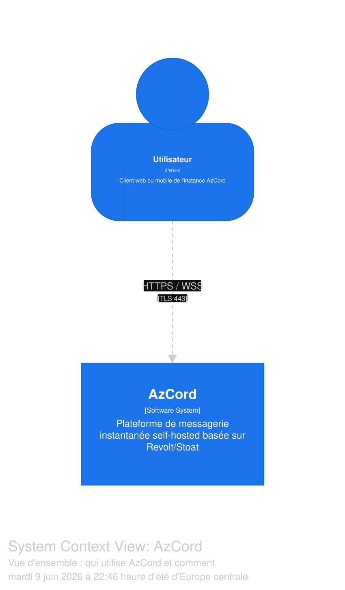
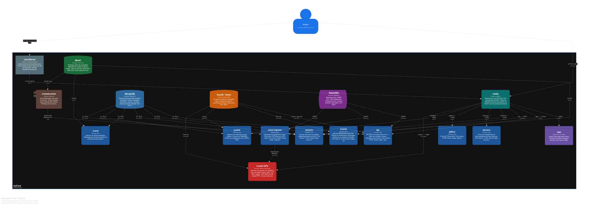
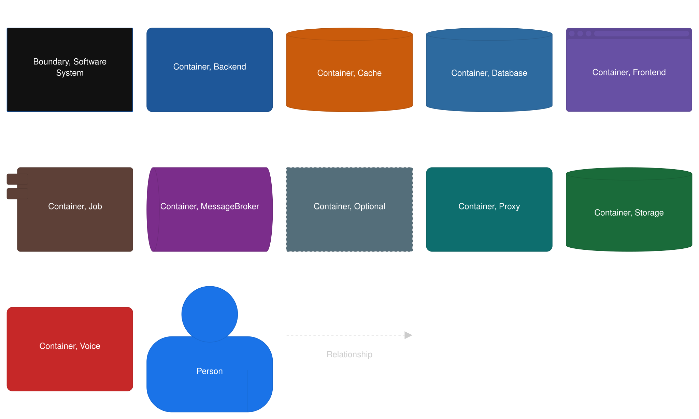
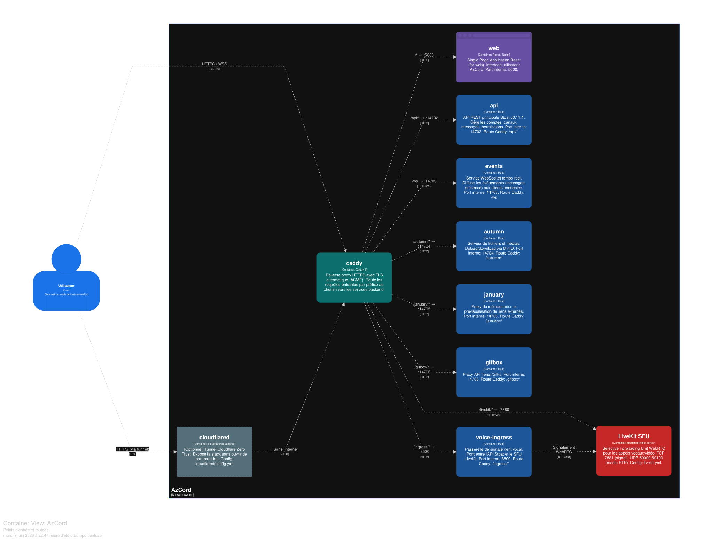
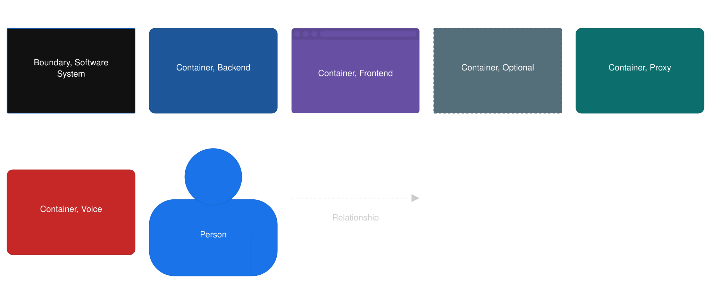
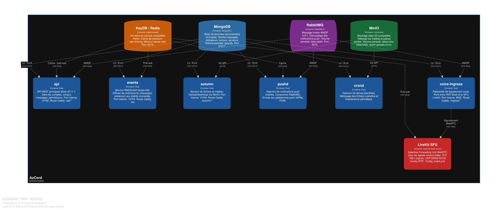
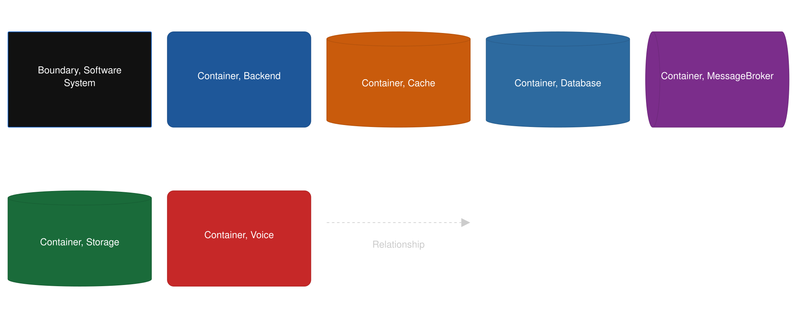

# AzCord — Documentation Architecture (POC)

> **POC** — Exploration de l'architecture de la stack [AzCord](https://github.com/AzLeCurieux/azcord) via le modèle C4 et Structurizr.

---

## Contexte

[AzCord](https://github.com/AzLeCurieux/azcord) est un déploiement Docker Compose d'une plateforme de messagerie instantanée self-hosted basée sur [Stoat](https://github.com/stoatchat/stoatchat). La stack comporte une quinzaine de services interdépendants (reverse proxy, API REST, WebSocket, stockage objet, base de données, broker de messages, SFU WebRTC...).

L'objectif de ce dépôt est de **cartographier et comprendre les responsabilités de chaque service et les flux entre eux**, avant d'aller toucher à la configuration ou de faire évoluer le déploiement.

L'approche retenue est le **modèle C4** (Simon Brown), décrit en [Structurizr DSL](https://docs.structurizr.com/dsl), qui produit des vues à différents niveaux d'abstraction sans se perdre dans les détails d'implémentation.

---

## Modèle C4 — Niveaux de vue

Le modèle C4 organise l'architecture en couches :

| Niveau | Vue | Audience |
|--------|-----|----------|
| L1 | **System Context** | Qui utilise le système et avec quoi il interagit |
| L2 | **Containers** | Les unités déployables (ici : les services Docker) |
| L3 | Components | Composants internes d'un container (non couvert ici) |

---

## Vue 1 — Contexte Système

Qui interagit avec AzCord et comment.



---

## Vue 2 — Containers (stack complète)

Tous les services Docker Compose, leurs technologies, et les flux entre eux.



<details>
<summary>Légende des relations</summary>



</details>

---

## Vue 3 — Points d'entrée et routage

Le chemin d'une requête utilisateur depuis internet jusqu'aux services applicatifs, en passant par Caddy et les règles de routage par préfixe.



<details>
<summary>Légende</summary>



</details>

---

## Vue 4 — Infrastructure de données

Les dépendances entre les services applicatifs et l'infrastructure sous-jacente (MongoDB, KeyDB, RabbitMQ, MinIO, LiveKit).



<details>
<summary>Légende</summary>



</details>

---

## Ce qu'on apprend du modèle

**caddy est le seul point d'entrée réseau.** Toutes les requêtes HTTPS et WSS arrivent sur caddy, qui route par préfixe de chemin vers chaque service. `cloudflared` est optionnel et se branche en amont de caddy pour exposer la stack sans ouvrir de ports.

**L'API (`api`) est le service le plus couplé.** Elle dépend de MongoDB (données), KeyDB (cache et pub/sub), et RabbitMQ (événements asynchrones). Toute modification de l'infrastructure de données l'impacte.

**`events` est découplé de l'API.** Le service WebSocket ne passe pas par `api` — il lit MongoDB et KeyDB directement pour diffuser les événements aux clients connectés.

**Le workflow vocal est séparé.** `voice-ingress` sert de pont de signalement entre l'API Stoat et le SFU LiveKit. LiveKit gère lui-même le media RTP (UDP 50000-50100) indépendamment du reste de la stack.

**`createbuckets` est un job d'init one-shot.** Il crée le bucket MinIO `revolt-uploads` au démarrage et conditionne (`depends_on`) le démarrage de `autumn`. C'est le seul service sans redémarrage automatique.

---

## Source DSL

Le modèle complet est dans [`azcord.dsl`](azcord.dsl) — format [Structurizr DSL](https://docs.structurizr.com/dsl).

Pour l'explorer interactivement, coller le contenu sur [playground.structurizr.com](https://playground.structurizr.com/).

---

## Automatisation via MCP + Claude Code

Ce POC a été produit en branchant le serveur MCP officiel de Structurizr sur [Claude Code](https://claude.ai/code), ce qui permet de valider et d'exporter le DSL sans quitter le terminal.

### Principe

[Structurizr expose un serveur MCP](https://docs.structurizr.com/ai/mcp) (Model Context Protocol) public. Une fois enregistré dans Claude Code, ses outils deviennent disponibles directement dans la session : validation du DSL, export PlantUML, export Mermaid.

```
Claude Code  ──→  MCP Structurizr  ──→  validate / export-c4plantuml / export-mermaid
                  mcp.structurizr.com
```

### Configuration

Ajouter le serveur MCP au projet (une seule fois) :

```bash
claude mcp add structurizr-mcp --transport http https://mcp.structurizr.com/mcp
```

Vérifier que la connexion est active :

```bash
claude mcp list
# structurizr-mcp: https://mcp.structurizr.com/mcp (HTTP) - ✔ Connected
```

Le serveur expose les outils suivants :

| Outil | Description |
|-------|-------------|
| `validate` | Vérifie la syntaxe du DSL et remonte les erreurs |
| `parse` | Parse le DSL et retourne le workspace JSON |
| `inspect` | Inspecte le contenu du workspace |
| `export-c4plantuml` | Exporte une vue en C4-PlantUML |
| `export-plantuml` | Exporte une vue en PlantUML standard |
| `export-mermaid` | Exporte une vue en Mermaid |

### Workflow

1. Écrire ou modifier `azcord.dsl`
2. Demander à Claude Code de valider — il appelle `validate` via MCP et remonte les erreurs de syntaxe directement
3. Une fois valide, exporter les vues souhaitées via `export-c4plantuml` ou `export-mermaid`
4. Les fichiers `.puml` et `.mmd` générés peuvent être rendus dans n'importe quel outil compatible PlantUML/Mermaid

### Régénérer les diagrammes

Le serveur MCP est aussi appelable directement en HTTP si besoin de scripter hors de Claude Code :

```bash
# Valider le DSL
curl -s -X POST https://mcp.structurizr.com/mcp \
  -H "Content-Type: application/json" \
  -H "Accept: application/json, text/event-stream" \
  -d "{\"jsonrpc\":\"2.0\",\"method\":\"tools/call\",\"params\":{\"name\":\"validate\",\"arguments\":{\"dsl\":$(jq -Rs . < azcord.dsl)}},\"id\":1}"

# Exporter la vue Containers en C4-PlantUML
curl -s -X POST https://mcp.structurizr.com/mcp \
  -H "Content-Type: application/json" \
  -H "Accept: application/json, text/event-stream" \
  -d "{\"jsonrpc\":\"2.0\",\"method\":\"tools/call\",\"params\":{\"name\":\"export-c4plantuml\",\"arguments\":{\"dsl\":$(jq -Rs . < azcord.dsl),\"viewKey\":\"Containers\"}},\"id\":2}" \
  | jq -r '.result.content[0].text | fromjson.definition'
```

---

## Repo de déploiement

[github.com/AzLeCurieux/azcord](https://github.com/AzLeCurieux/azcord)
